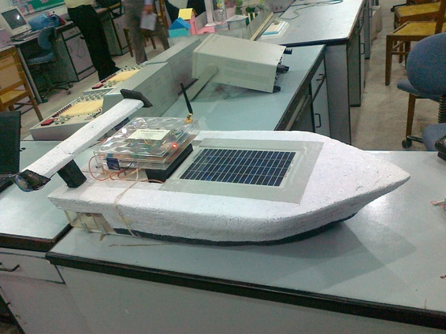
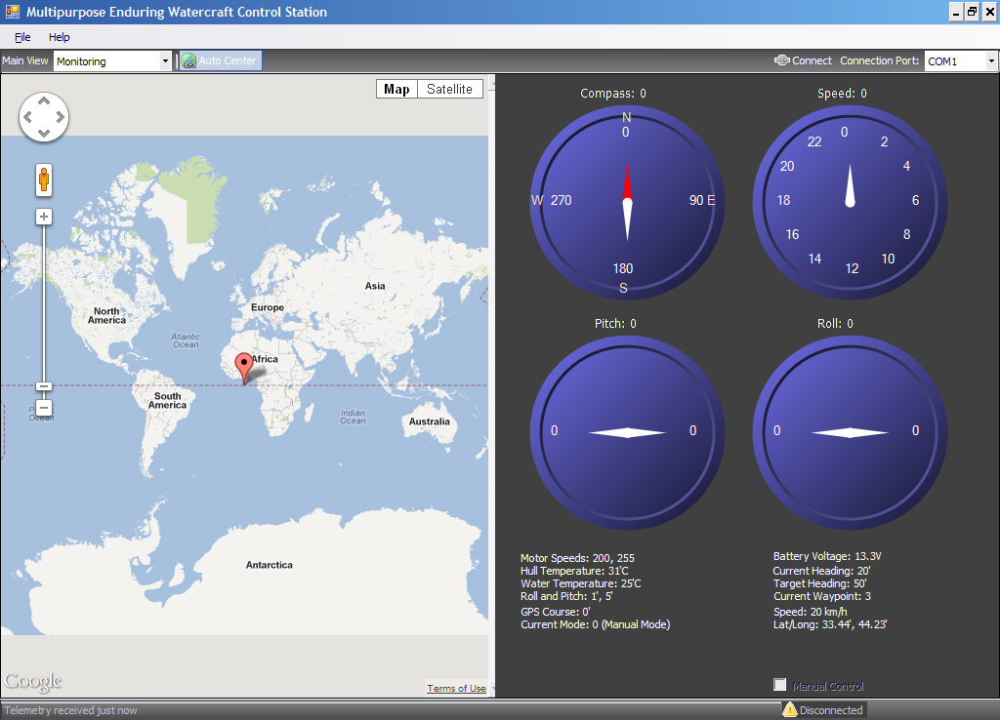

Prototype of Autonomous Solar Watercraft

This was quite an old project of mine.

Autonomous Solar Watercraft was my bachelors final year project. The project consists of fully working prototype of autonomous navigating watercraft which can charge itself with solar panels while it is on the go. This means when it is in the water, it is also charging. In the night, it can use the stored energy from the battery and charge itself in the day. So in theory, this watercraft has unlimited range. Therefore It was named as Multipurpose Enduring Watercraft. The project was initially proposed as a tool to evaluate, monitor or search in remote sea areas, thus the name multipurpose. And enduring because it can endure in water for long periods of time without returning back to shore.

The project also consisted of Control Station app, which was wirelessly connected to the watercraft. This app configures and monitors the watercraft. The app has an intuitive GUI.

Control app GUI
