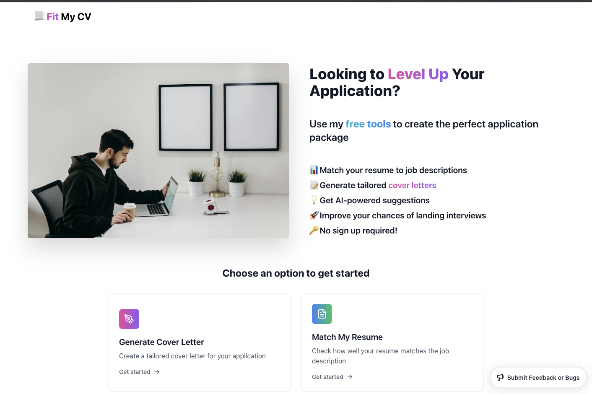

I have spent way too many late nights stressing about job applications. 
You know the drill - endlessly tweaking resumes, writing cover letters, wondering if you are even competitive. 
It is exhausting.

So I built something to help. [Fit My CV](https://fit-my-cv.mujtabachang.com/) is a free tool that:
- Shows how well your resume matches job posts
- Generates cover letters that don't sound robotic  
- Gives you tips to improve your application
- Works instantly - no signing up for stuff

## How it Works

Drop in your resume and a job description. 
The tool analyzes them using AI to show what is matching and what is missing. 
Need a cover letter? It will generate one that actually sounds like you wrote it.

I built it using React, TypeScript and n8n as a backend. 
You might ask why n8n? Why not pure NodeJS or NestJS? That's a good question.
The tech stack is not really the point though - I just wanted something that I can quickly build and iterate on.
n8n is actually a nice no-code tool to quickly set things up and make API endpoints. 

## Why I Made This

Job hunting is stressful enough without the endless resume tweaking and cover letter writing. 
I originally built this just for myself, but figured others might find it useful too.

That is why I am keeping it completely free - no signups, no premium tier, no nonsense.
Just paste your stuff and get help making your application better.

## What's Next

I have got some ideas to make it even more useful:
- Resume formatting suggestions
- Job search tracker
- Local saving of applications  
- More AI insights

But I am really curious what would make it more helpful for you. 
I am actively using this myself while job hunting, so I want to make it as useful as possible.

Check it out at [fit-my-cv.vercel.app](https://fit-my-cv.mujtabachang.com/) and let me know what you think!

You can find me on [Twitter](https://twitter.com/mujtaba_chang).

Enjoy while it is free! 🚀
