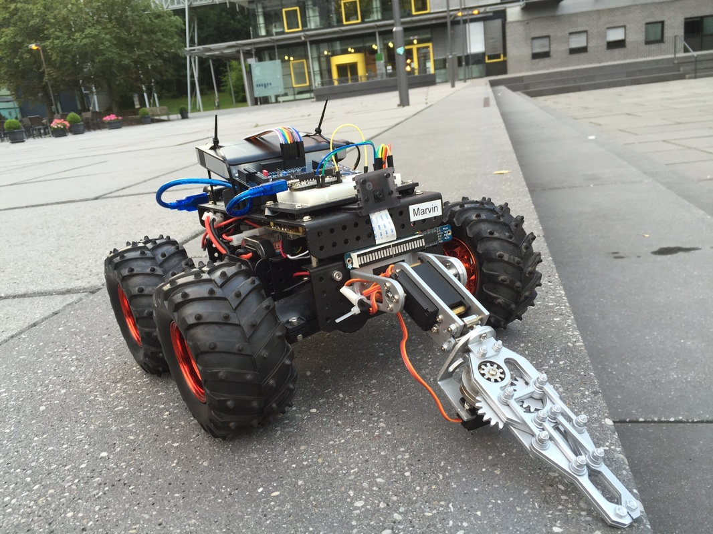

**Meet my robot, Marvin**

Marvin was my Embedded Systems course project at [Saarland University](http://www.uni-saarland.de/en/home.html), Germany. The course was taught by [Prof. Dr. Bernd Finkbeiner](https://www.react.uni-saarland.de/people/finkbeiner.html) . In short amount of 2-3 months we had to come up with a complete working embedded project, with Simulink virtual model, engineering notebook, risk document and finally specification document.

It was a group project, my group members were Christoph Rosenhauer and Konstantin Kopper.

**Marvin's goal**: To follow the tennis ball. It may look simple. But it was pretty demanding task, specially when you take the speed of the ball into consideration and other problems in the image processing and computer vision, there was some control theory at the Arduino end as well. The initial decision was to design it in FPGA. However it was not possible since the Raspberry Pi Camera protocol (CSI-2) was proprietary and the specifications are not available to the public. In fact there is a reward of [$1000 who writes a driver for Pi camera for FPGA.](https://www.parallella.org/2015/06/01/the-open-camera-project-1000-bounty-for-open-firmwaredrivers-for-raspberry-pi-camera-module/)

Some technical information

Processors: **Raspberry Pi v3, Arduinos**  
Camera: **Raspberry Pi camera capturing at 90 FPS**  
Chassis: **Wild Thumper 4WD**

<iframe width="100%" height="315" src="https://www.youtube.com/embed/IR2AxS9N79k?si=lglnjQ_VYjT9LGCI" title="YouTube video player" frameborder="0" allow="accelerometer; encrypted-media; gyroscope; picture-in-picture; web-share" referrerpolicy="strict-origin-when-cross-origin" allowfullscreen></iframe>

Some more pictures of Marvin

For more information or source code, please contact me.
