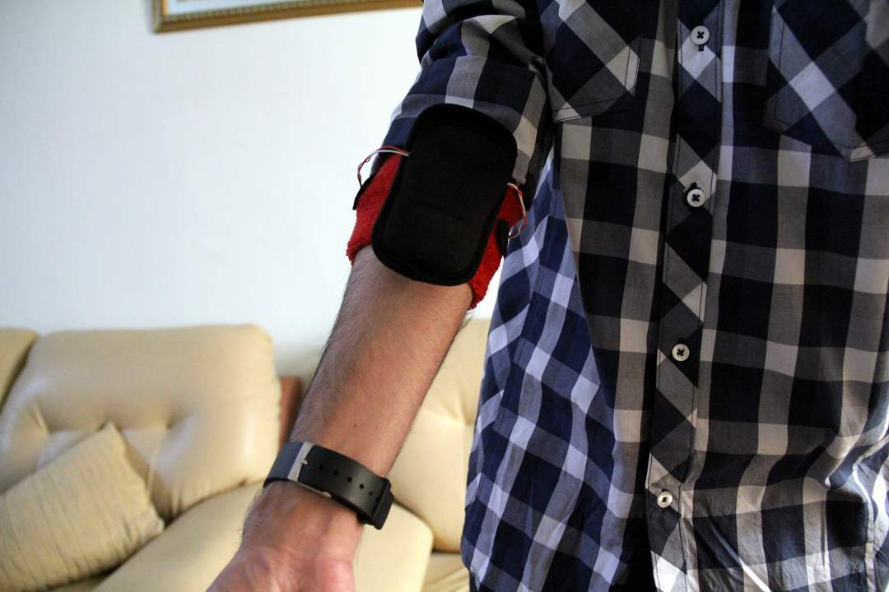
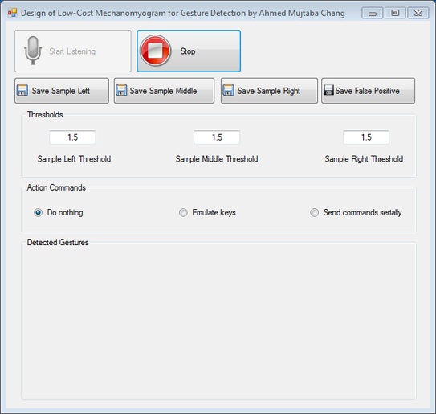
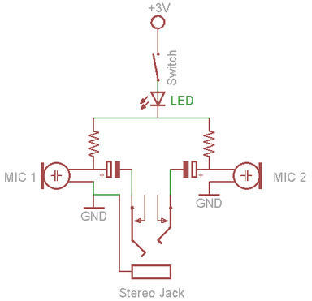
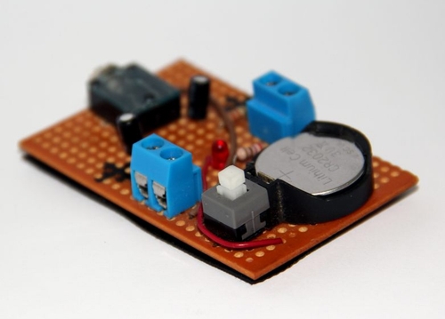
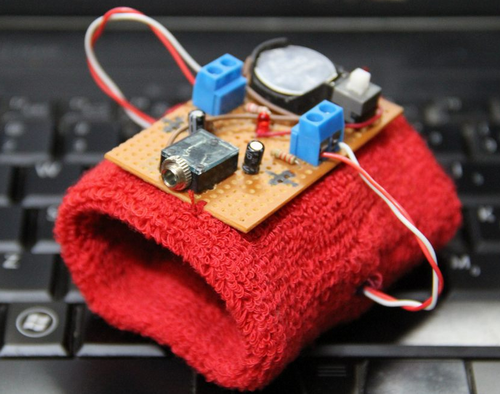

## Mechanomyogram Device for Gesture Detection

MMG Device worn on the forearm

**A low cost hardware assisted hand gesture detection app**

[Mechanmyogram](https://en.wikipedia.org/wiki/Mechanomyogram), or [MMG](https://en.wikipedia.org/wiki/Mechanomyogram) for short, is a biomedical signal that is emitted by the muscles.This signal is detected from the forearm muscles to know what hand gesture is made and fed into the computer. The whole thing costs around 5 dollars. This was my Masters project at Mehran University.

## How it works

​MMG works on the principle of sound waves. The muscle fibers when move, make noise and this noise is picked up by the microphone. Then this microphone signal is collected by computer sound card. [DTW algorithm](https://en.wikipedia.org/wiki/Dynamic_time_warping) does the magic of detecting the gestures with already saved ones in the memory.

Basically you plug in the MMG Device (the hardware), switch it on. Open the application and a nice GUI will pop up. Click Start Listening. Now to detect gestures, all you have to do is to make a gesture and then click Save Sample Left/Middle/Right buttons. That's it. Now try making that gesture again. The app will be able to detect it.

## Hardware

The hardware is an armband with circuit and microphones in it. Which is based on [Xth Sense](http://res.marcodonnarumma.com/category/project-xth-sense/hardware-design/), but with addition of two microphones. However the project code only uses Mono for now (Both mics will be used for future).

Schematic

Soldered circuit on the veroboard

Circuit added onto armband which houses microphone sensors
