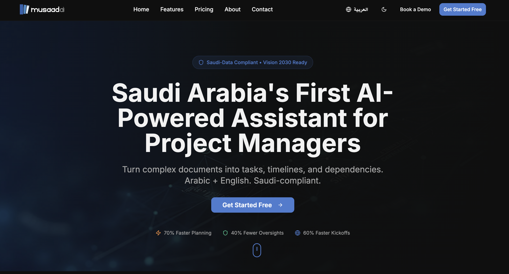

I built Musaad AI with another talented co-founder to tackle project management challenges in Saudi Arabia. Existing tools just didn't get Saudi business culture or handle Arabic well, so we decided to create our own solution.

## What Musaad AI Does

Musaad is an AI assistant that helps project managers in Saudi Arabia. It understands both Arabic and English, converts documents into project plans, and aligns with local business practices. Upload your documents and it automatically extracts tasks, timelines, and dependencies.

Our users are seeing some pretty cool results. Planning is happening much faster, they are catching more potential issues before they happen and project kickoffs are much smoother.

## The Tech Behind It

We built several key components:

### Document Processing
The AI extracts project elements from uploaded documents in both Arabic and English.

### PMI Framework Integration
We implemented proper Project Management Institute methodologies into the AI's understanding.

### Bilingual Capabilities
The system handles conversations and document processing in both languages seamlessly.

### Saudi Compliance
Everything is built with Saudi data regulations in mind from the start.

## Current Status

The platform is up and running at [musaadai.com](https://www.musaadai.com/). We're continually improving it based on feedback from project managers across Saudi Arabia.

If you want to check it out:
- [Try the free version](https://app.musaadai.com/)
